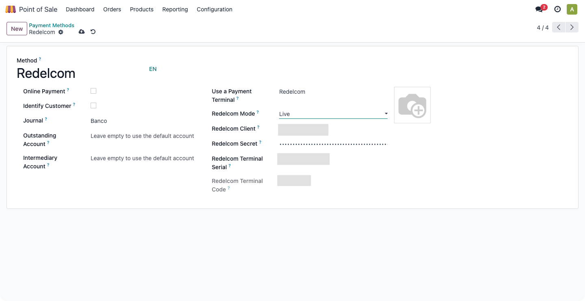

# POS Redelcom
Integrate your POS with a Redelcom payment terminal.

## Configuration
First, go to **Point of Sale > Configuration > Payment Methods** and create a new
payment method.

If the values provided are correct the *Redelcom Terminal Code* field will be
filled automatically when saving the changes.

Finally, go to **Point of Sale > Configuration > Settings** and enable the new payment
method at each point of sale where it will be used.

## Usage
By clicking on the payment method we will have a button available that will allow us to
send the transaction to Redelcom payment terminal.

## Known issues
Just for the record, this module was tested with the Redelcom A910 payment terminal.
